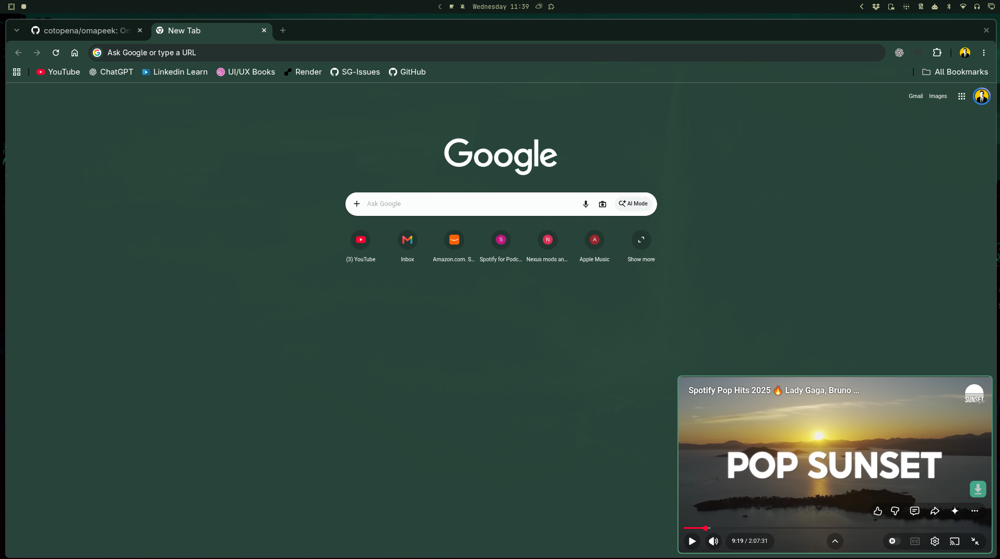
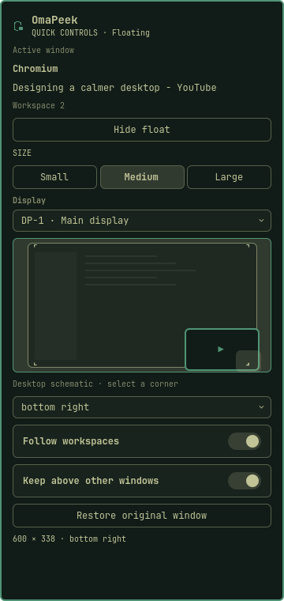

# OmaPeek

Keep your video in view.

Keep a YouTube video in the corner while you work. Click the **OmaPeek icon** in the Omarchy bar to open Quick Controls, then choose **Float video** to shrink and pin your YouTube window. Choose **Restore original window** to return it. Hover over the icon to see the **OmaPeek** tooltip.

No Chrome extension installation, account, API key, or browser profile setup is needed.



*OmaPeek keeping a YouTube video in view while another browser window stays available.*

## Use it

1. Open a video in the YouTube app or a Chromium window and start playback.
2. Click the **OmaPeek icon** and choose **Float video**, or press **Super + Ctrl + Shift + P** if you installed the shortcut.
3. Hover over the small video for YouTube's play/pause, volume, and seek controls. Choose **Restore original window** or press the shortcut again to restore its workspace and window mode.

The player starts at 600 × 338 in the bottom-right corner of your focused display. It remains visible when you switch workspaces on that display. Use your usual Omarchy window move/resize gestures to reposition it.

Keep the YouTube window open. Closing it stops playback. This plugin shrinks the existing window, so it cannot leave that same window available for browsing another page at the same time.

### Quick Controls

The popup shows the supported video window, its workspace, connected displays, and a schematic of its current geometry. Pick Small (400), Medium (600), or Large (800 pixels wide), a display, or any corner. Sizes are constrained to the display work area. The diagram is letterboxed to the display's logical aspect ratio; its quiet editor shapes are illustrative, not a live desktop capture. The video marker uses actual window position and size.



*Quick Controls preview with sample window data. The monitor diagram illustrates placement rather than showing a live desktop capture.*

**Hide float** parks the window on a dedicated special workspace without stopping playback. **Show float** returns it. If the display it was hidden from has been disconnected, Show uses the focused display and the selected corner. **Follow workspaces** pins the float on its display. **Keep above other windows** raises it whenever focus or windows change, with a check every 12 seconds as a fallback, while the widget runs. Hyprland has no independent always-above flag, so another floating window can briefly cover it until the next raise. Turning this off stops raising; floating windows still normally sit above tiled windows. Other monitors' fullscreen windows and compositor overlays are not overridden.

While the widget runs, a visible float left with no monitor, or with no part inside any connected display's usable area, is moved silently to the selected corner of a connected display, keeping Follow. This also happens with Keep above off, which only controls raising. Floats still partly on a display keep their position, hidden floats stay hidden until Show, and Show uses the selected corner when the saved position is no longer on screen. Each recovery command re-checks the window's identity in the compositor first, so a replacement window is never moved. A failed recovery stays pending and is retried while the original window is still tracked; if that window closed, OmaPeek stops tracking it and discards its saved state on the next float or restore.

Tab moves through controls, Enter/Space activates them, and Escape dismisses the popup. Dropdowns support arrow keys. Short popups scroll, including automatically revealing keyboard focus. Keyboard and IPC `toggle` retain the original float/restore behavior rather than toggling the menu.

### If fullscreen does not activate

The plugin uses YouTube's **F** shortcut. Start with the player selected, rather than a search field or comment box. If the small window shows the whole page, choose **Restore original window**, select YouTube's fullscreen button, then use **Super + Ctrl + Shift + P**. Browser extensions that intercept F can also affect automatic activation.

## Install locally

Requires Omarchy's Quickshell plugin system, Hyprland with the Lua dispatcher API (developed against 0.56.2), Python 3, and a Chromium-based browser. Firefox and other video sites are not supported by this version.

### Option A: plugin manager (recommended)

```sh
omarchy plugin add https://github.com/cotopena/omapeek --enable
```

This installs and enables the bar widget. It does not add a keyboard shortcut. To add the optional shortcut, run the installer from the installed plugin:

```sh
python3 ~/.config/omarchy/plugins/io.github.cotopena.omapeek/install.py
```

The installer keeps the widget where you placed it in the bar. It does not change the plugin-manager files, so `omarchy plugin update io.github.cotopena.omapeek` keeps working.

### Option B: from a clone

```sh
git clone https://github.com/cotopena/omapeek
cd omapeek
python3 install.py
```

The installer validates the plugin, copies it to `~/.config/omarchy/plugins/io.github.cotopena.omapeek`, enables it (a fresh install goes in the right section of the bar; an existing widget keeps its placement), and adds the Super + Ctrl + Shift + P shortcut to `~/.config/hypr/bindings.lua` if that shortcut is free. Existing plugin files, shell settings, and bindings are backed up under `~/.local/state/omapeek/backups/` before anything is written. To update, pull the clone and run the installer again.

Run the installer while your desktop is unlocked. If the bar retains old code after an upgrade, run:

```sh
omarchy restart shell
```

No setup is required in `chrome://extensions`.

## Marketplace package

`manifest.json` and `OmaPeekWidget.qml` are at the package root; `bin/omapeek` is resolved relative to the widget. The bar works when the plugin is installed and enabled through Omarchy's plugin system. `install.py` additionally installs the optional desktop shortcut.

Package ID: `io.github.cotopena.omapeek`. The controller is `bin/omapeek`, and optional shortcut markers are `-- BEGIN OmaPeek` / `-- END OmaPeek`.

Source: [cotopena/omapeek](https://github.com/cotopena/omapeek). The marketplace listing is pending submission and review.

### Upgrade from OmaFloat

Return any floating or hidden video using the old plugin first. Remove `io.github.cotopena.omafloat` through the plugin manager, and remove the shortcut block between `-- BEGIN OmaFloat` and `-- END OmaFloat` from `~/.config/hypr/bindings.lua`. Run `hyprctl reload` and `hyprctl configerrors`, then install OmaPeek with the commands above. The new package uses its own runtime directory, `omapeek`, and hidden workspace, `special:omapeek-hidden`. The installer refuses to overwrite the old shortcut automatically. Existing backups remain available in `~/.local/state/omafloat/backups/`.

### Upgrade from Float Video

Return any floating video first. Remove the old `gus.float-video` plugin through the plugin manager. If you installed its keyboard shortcut, remove the block between `-- BEGIN Omarchy Float Video` and `-- END Omarchy Float Video` from `~/.config/hypr/bindings.lua`, then run `hyprctl reload` and `hyprctl configerrors`. Install OmaPeek using either method above. The installer refuses to replace an existing legacy shortcut automatically. Existing backups remain under `~/.local/state/omarchy-float-video/backups/`.

Version 0.2 replaced the old companion-based prototype, and OmaPeek does not use a browser extension. Any extension previously loaded manually for Float Video can be removed separately in Chromium.

## Behavior and limits

- Chooses the most recently focused supported YouTube window. A video must be the selected tab in a regular browser window.
- Keeps the same video session and playback position, using YouTube's fullscreen player inside a floating window.
- Saves the original workspace, monitor, floating geometry, pin status, fullscreen flags, and fullscreen synchronization setting. A tiled window returns to tiling, though its exact slot may change.
- Returns the window to its original workspace even if that workspace has since moved to another display, for example after undocking and redocking. A floating window then keeps its original size, and Hyprland chooses its position.
- If a return does not complete, choose **Restore original window** again. A second failure releases the window as it is, so you can arrange it yourself. A hidden float is first moved back to a visible workspace; OmaPeek keeps tracking it until that succeeds.
- Restores existing fullscreen state if YouTube was fullscreen before activation.
- Rejects grouped windows and special workspaces. Unlock the desktop before activating it.
- State is local to the current Hyprland session. Closed windows are matched by address, process, and stable ID so a reused address does not affect another app.
- If you manually exit fullscreen while floating, choose **Restore original window** before floating again.
- No network calls, browser debugging connection, downloaded video, or third-party player are used by the plugin.

## Development

```sh
omarchy plugin validate .
python3 -m unittest discover -s tests -v
python3 bin/omapeek status
python3 bin/omapeek restore
```

The helper accepts `--width 320..1200` and an explicit `--window 0x...` for testing. Controls use serialized commands:

```sh
python3 bin/omapeek float
python3 bin/omapeek configure --width 800 --corner top-left --monitor DP-1
python3 bin/omapeek configure --follow false --above false
python3 bin/omapeek hide
python3 bin/omapeek show
```

`status` returns the tracked/eligible window, monitor metadata, current visibility/pinning, and placement options without taking the mutation lock. User actions briefly wait for the controller lock (up to three seconds); background maintenance skips a busy lock. Mutations retain the original restoration snapshot; partial failures leave it available for retry, and a second consecutive failed restore releases the window. `maintain` is used by the running widget for stack-order enforcement and to recover visible floats left unreachable by display changes.

See [the isolated preview guide](docs/PREVIEW.md) for QML validation and fixture screenshot generation. See [VERIFICATION.md](VERIFICATION.md) for the current test record.

## Remove

Return the video first. Disable/remove `io.github.cotopena.omapeek` through Omarchy's plugin manager. Remove the block between `-- BEGIN OmaPeek` and `-- END OmaPeek` in `~/.config/hypr/bindings.lua`, then run `hyprctl reload` and `hyprctl configerrors`.

## License

OmaPeek's own contributions are [MIT licensed](LICENSE), Copyright (c) 2026 Gus.
The dropdown is adapted from [Omarchy](https://github.com/omacom/omarchy),
Copyright (c) David Heinemeier Hansson, also under MIT. See
[THIRD_PARTY_NOTICES.md](THIRD_PARTY_NOTICES.md) for source provenance and the
complete upstream notice. Keep both license files with redistributed copies.
